# Clínica Médica Online

## Objetivo

O projeto em questão foi desenvolvido como um dos requisitos da disciplina de Engenharia de Software da UNIFESP, e tem como principal objetivo o desenvolvimento de um software que apoie o processo de consultas médicas online. A plataforma web deve proporcionar o cadastramento de médicos e pacientes, o agendamento de consultas, a realização das consultas, o apoio à realização da consulta (como anamnese, histórico da consulta, receitas, inclusão de exames etc.). Tecnologias envolvidas: linguagens para desenvolvimento web, banco de dados relacional, cloud. 

## Execução

Para visualizar a aplicação em funcionamento, clone o repositório e execute o comando abaixo:

Obs.: É necessário ter o [docker](https://docs.docker.com/get-docker/) e o [docker-compose](https://docs.docker.com/compose/install/) instalado.

```bash
cd path/to/web-medical-clinic

docker volume create --name=postgres_database && docker-compose up --build
```

Com a aplicação no ar, execute o seguinte comando em um novo terminal para realizar as migrações e popular o banco de dados criado:
```bash
docker exec -it wmc-rails bash -c 'rails db:migrate db:seed'
```
Caso obtenha sucesso nas etapas acima, a aplicação já estará rodando na porta 3000: **https://localhost:3000**

Agora que a imagem da aplicação e o banco de dados foram criados, basta rodar `docker-compose up` na raiz do projeto sempre que quiser colocá-lo no ar. 
## Tecnologias Usadas

- Backend e Frontend: Ruby on Rails
- Bootstrap
- Docker
- HTML5 e CSS3

## Telas da Aplicação

### Home


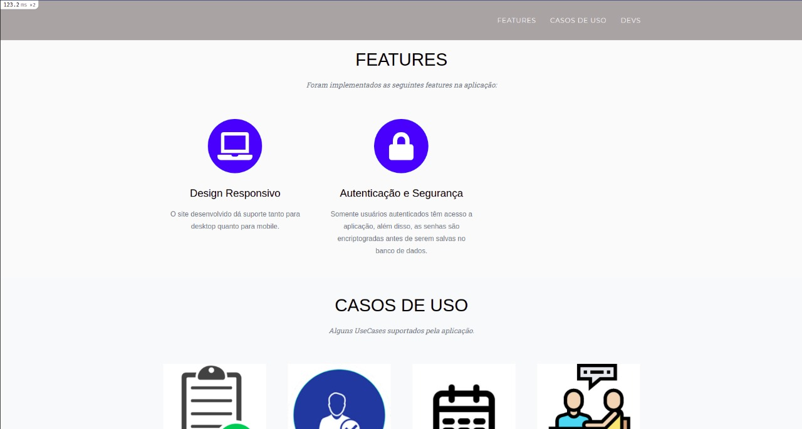
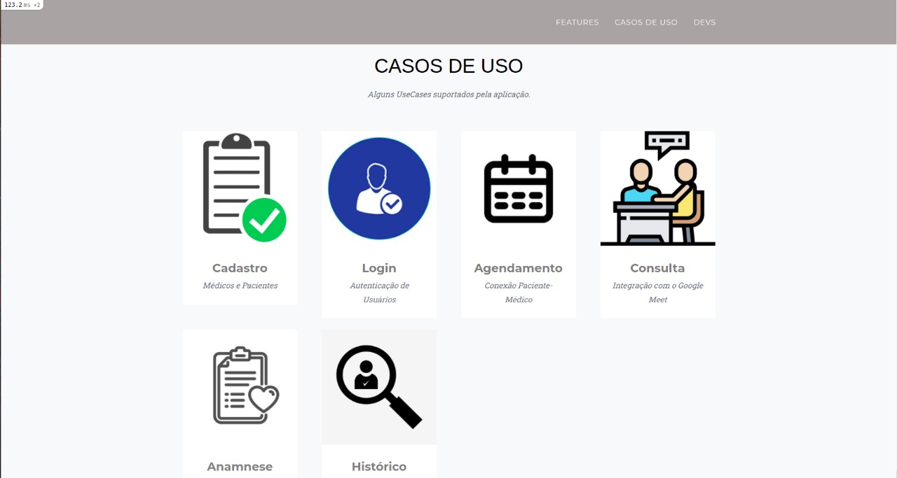
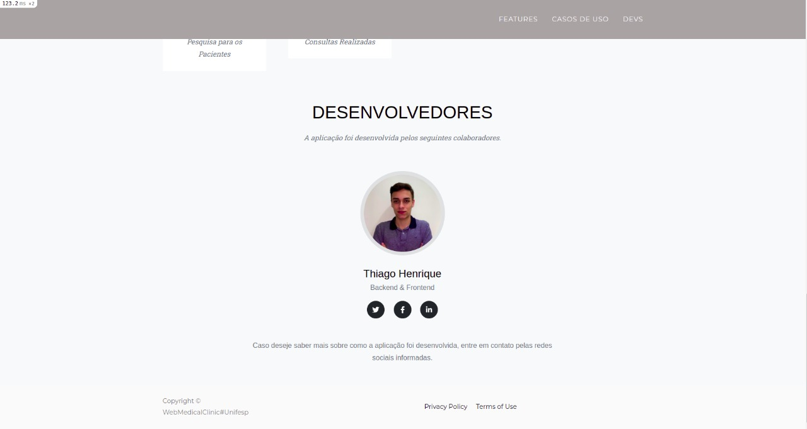

### Login

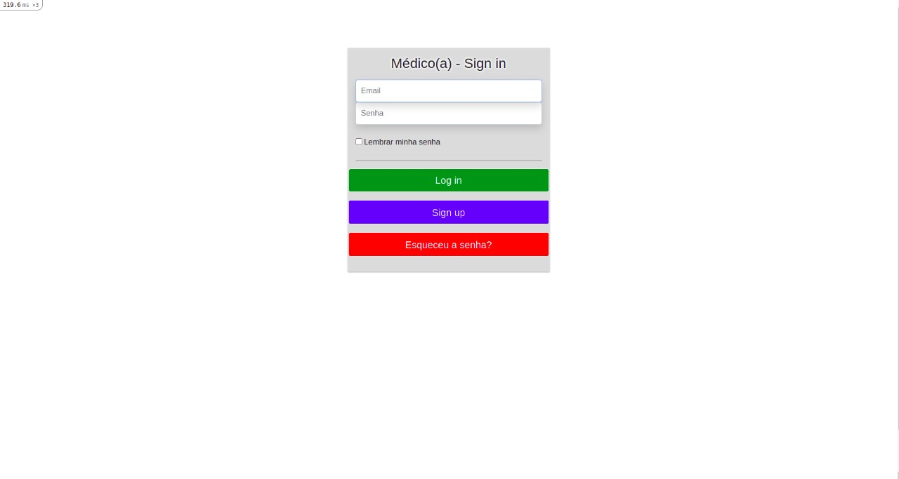
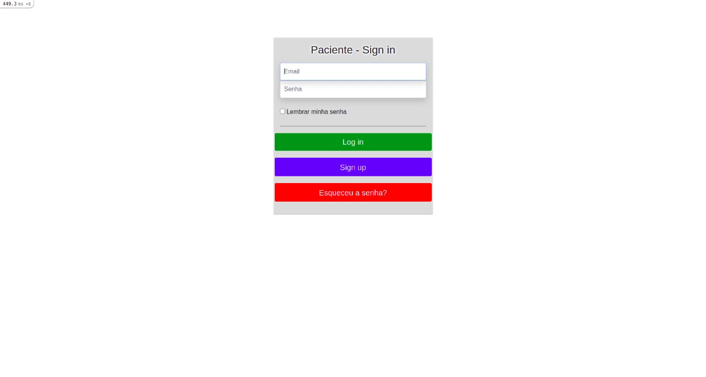

### Sign Up

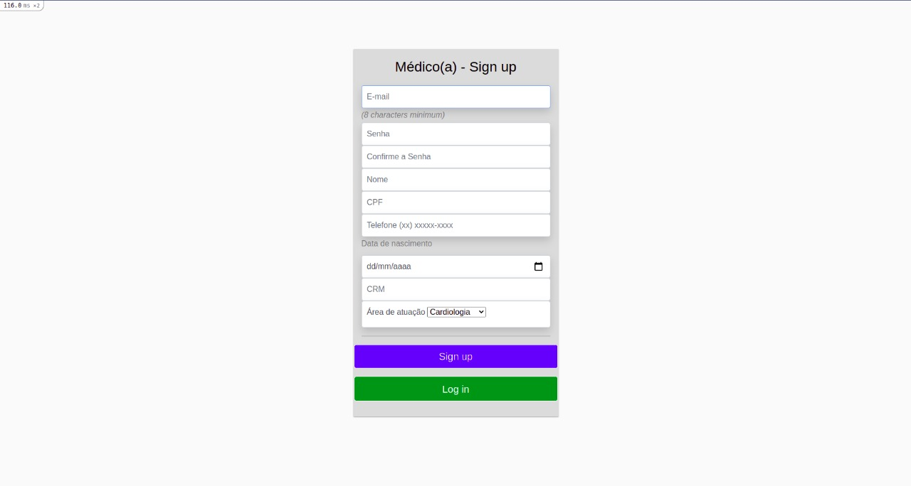
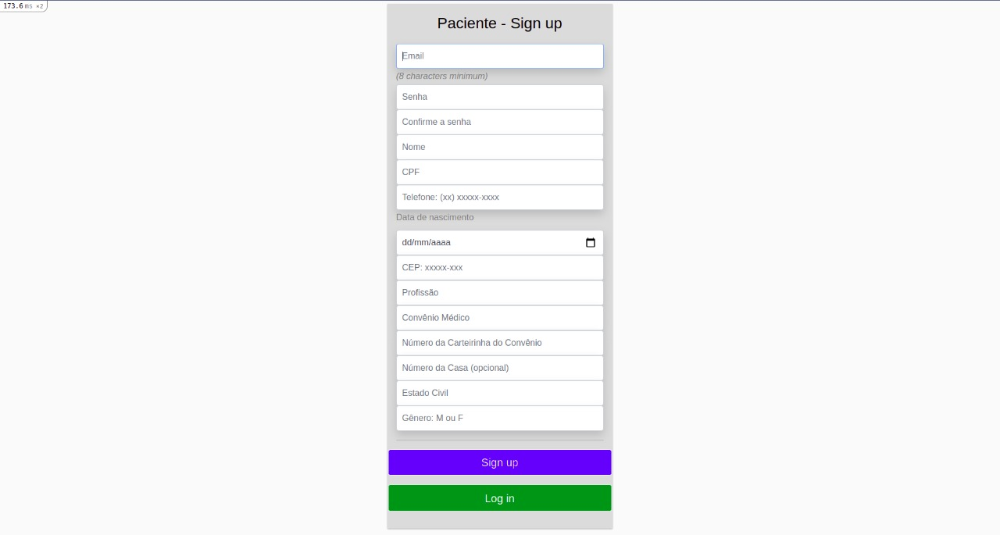

### Dashboards

#### Médico

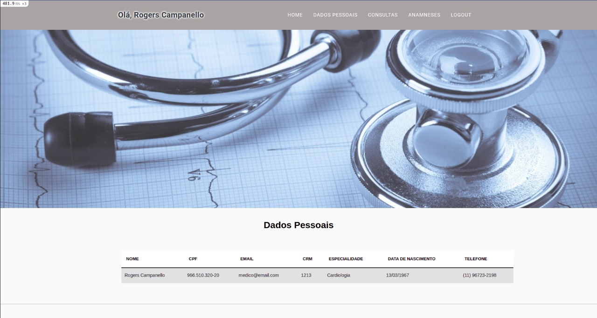
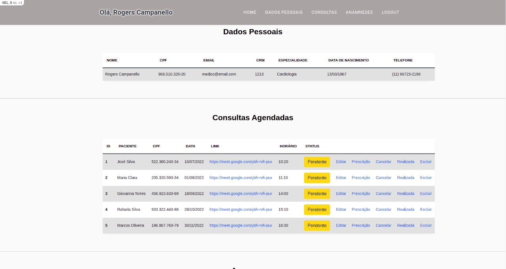
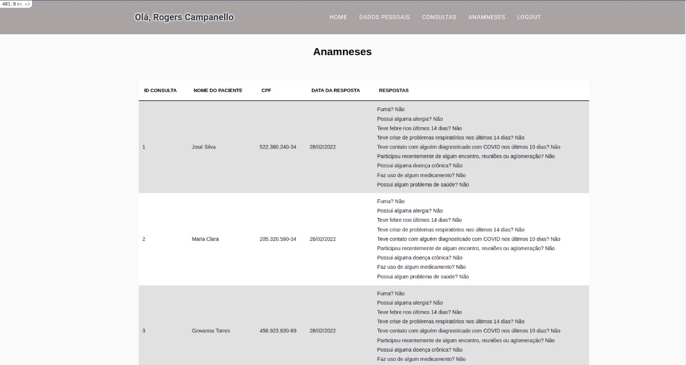

#### Paciente

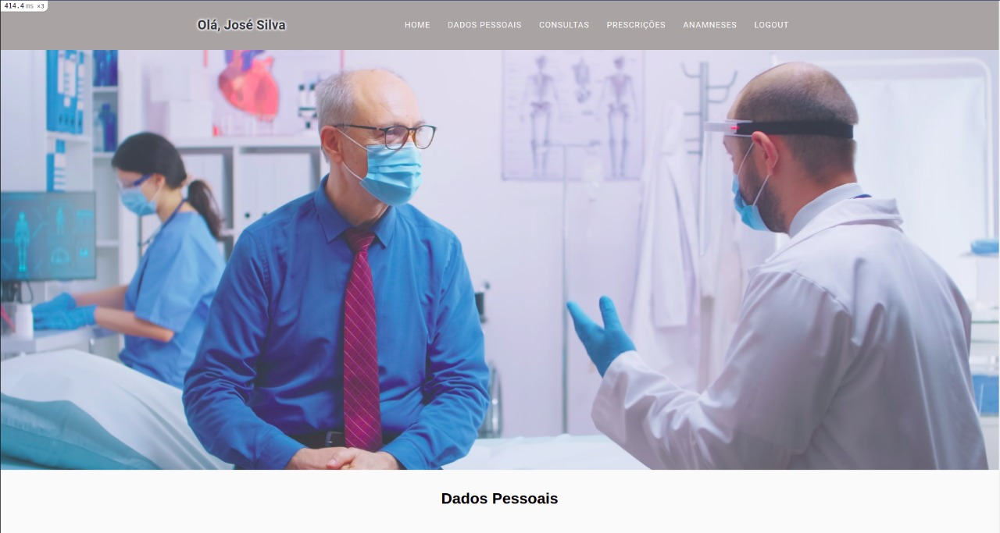
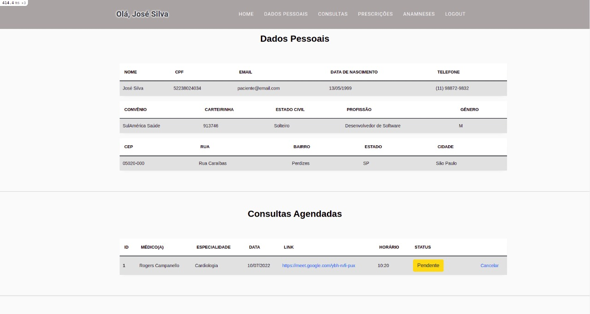
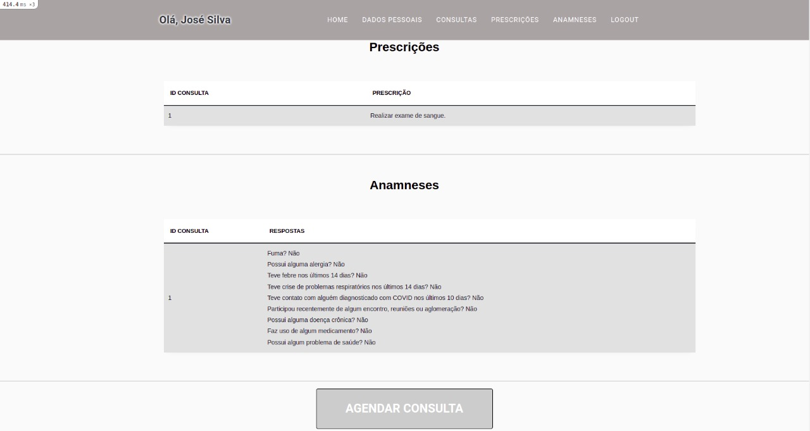

#### Agendar Consulta

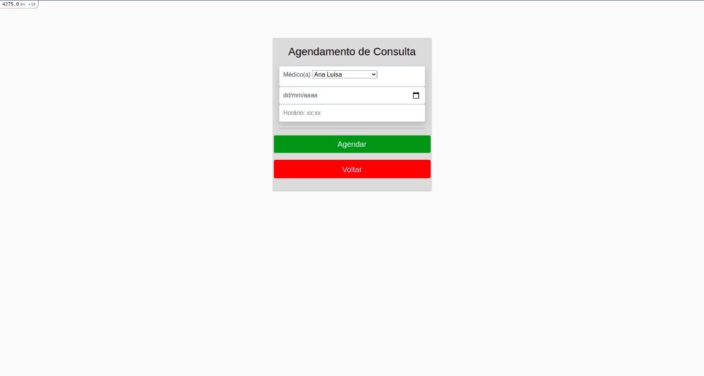
